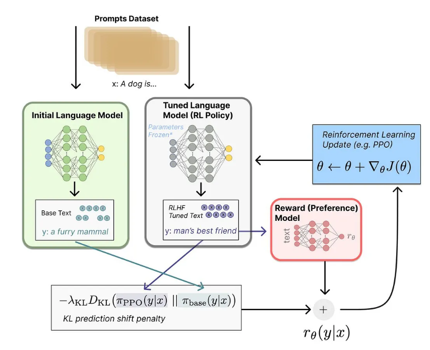
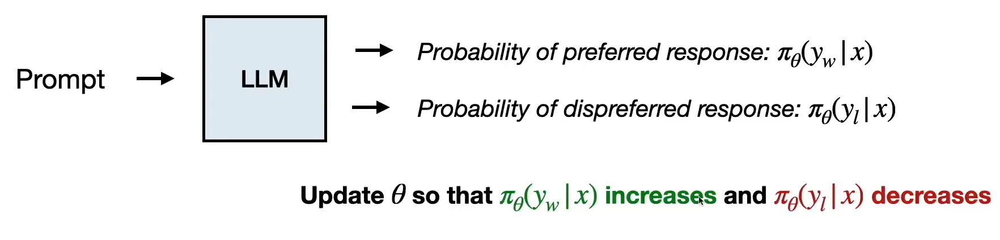

## 🎯 Learning Objectives

By the end of this study guide, you should be able to:

1. Map real-world healthcare problems to RL components (States, Actions, Rewards).
    
2. Explain why raw LLMs require Reinforcement Learning for better performance.
    
3. Describe the three-step pipeline of RLHF (Reinforcement Learning from Human Feedback).
    
4. Understand the difference between PPO and DPO in training language models.
    

## 🏥 Module 1: RL in Healthcare

_How RL optimizes critical decision-making in hospitals._

### 1. The Goal

To optimize sequential treatment strategies and resource management, moving beyond static protocols to dynamic, personalized care.

### 2. Case Study: Dosage Optimization

Automating the recommendation of intravenous fluids and vasopressors.

|RL Component|Healthcare Equivalent|
|---|---|
|**Agent**|The AI Treatment System|
|**Environment**|The ICU / Patient Body|
|**State (**$S_t$**)**|**Patient Data:** Demographics, vital signs, lab values, current fluid levels.|
|**Action (**$A_t$**)**|**Treatment:** Administering oxygen, adjusting ventilator pressure, setting volume of air.|
|**Reward (**$R_t$**)**|**Outcome:**  • Positive (+1) for survival.  • Negative (-1) for mortality.  • Intermediate: Improvement in clinical scores (e.g., Apache Score).|

### 3. Other Applications

- **Insulin Management:** Personalized dosing for Type 1 diabetes.
    
- **Resource Allocation:** Optimizing the distribution of ICU beds.
    

## 🤖 Module 2: RL in Chatbots (RLHF)

_Transforming a text predictor into a helpful assistant._

### 1. The Problem: Raw LLMs

Raw Large Language Models are trained on massive corpora to predict the next word based on similarity.

- **Issue:** They often produce nonsense, factually incorrect, or unsafe answers in Q&A scenarios.
    
- **Goal:** Alignment—moving from _predicting words_ to _understanding intent_.
    

### 2. The Solution Pipeline: RLHF

Reinforcement Learning from Human Feedback (RLHF) aligns the model in three steps:

#### Step A: Supervised Fine-Tuning (SFT) — "Learning the Format"

- **What it is:** The model is trained on high-quality (Prompt + Answer) pairs written by humans.
    
- **Outcome:** The model learns the **format** of a Q&A interaction.
    
- **Limitation:** It mimics style but doesn't necessarily optimize for quality or truthfulness.
    

#### Step B: Reward Modeling — "Learning Human Preferences"

- **What it is:** Humans rank multiple answers generated by the model.
    
- **Mechanism:** A **Reward Model** (a modified LLM with a regression layer) is trained on these rankings.
    
- **Outcome:** The system learns a scoring function: $R(good) > R(bad)$.
    

#### Step C: The PPO Training Loop — "Learning to Behave"

- **The Loop:**
    
    1. **Student (SFT Model)** generates an answer.
        
    2. **Teacher (Reward Model)** grades the answer.
        
    3. **Optimization (PPO):** The model adjusts its weights to increase the probability of high-scoring answers.
        
- **Safety Mechanism (KL Divergence):** A penalty is applied if the model changes too drastically from the original SFT model. This prevents "Reward Hacking" (babbling nonsense just to trick the reward model).
    

## 🚀 Module 3: Advanced Optimization (DPO)

_Simplifying the process._

### The Bottleneck

RLHF with PPO is complex and computationally expensive because it requires maintaining and training multiple models simultaneously (SFT model, Reward model, Value model, Actor model).

### The Innovation: Direct Preference Optimization (DPO)

- **Origin:** Stanford, 2023.
    
- **Key Idea:** We can skip the separate Reward Model.
    
- **Mechanism:** The LLM is trained **directly** on the human preference data using **Contrastive Loss**.
    
- **Process:** It mathematically compares the probability of the _preferred_ answer vs. the _rejected_ answer and optimizes the model in one step.
    

## ✅ Self-Study Check & Answer Key

### 📚 Exam Prep: LLMs, RLHF & Healthcare Scenarios

#### 1️⃣ Direct Theory Questions

_Focus: Definitions and understanding the "Why"._

**Q: Why are pre-trained LLMs insufficient for QA/Chatbots?**

> **Answer:** Pre-trained LLMs are essentially "similarity-based" models trained to predict the next token from large corpora. Consequently, they may generate fluent but **incorrect, unsafe, or nonsensical answers**, as statistical likelihood does not equate to human preference or correctness.

**Q: Why isn't Supervised Fine-Tuning (SFT) enough to make a great chatbot?**

> **Answer:** SFT teaches the model **how** to speak (the format) but not **what** is best (the quality). It relies on imitation; if the training data contains errors, the model copies them. It lacks a signal to distinguish "okay" answers from "excellent" answers.

**Q: What is a Reward Model in RLHF?**

> **Answer:** A neural network trained to score complete LLM responses based on human preference data. It outputs a scalar reward indicating answer quality and is trained using a pairwise ranking loss.

---

#### 2️⃣ Comparative Analysis

_Focus: Distinguishing between concepts (High probability of appearing in exams)._

**Q: Compare SFT vs. RLHF**

|**Feature**|**SFT (Supervised Fine-Tuning)**|**RLHF (Reinforcement Learning from Human Feedback)**|
|---|---|---|
|**Type**|Supervised Learning|Reinforcement Learning|
|**Data**|Labeled prompt-answer pairs|Human preference rankings|
|**Goal**|Learns **Format** (Instruction following)|Learns **Quality** (Human preference)|
|**Architecture**|Single Model|Multiple Models (Policy, Reward, Ref)|

**Q: Compare PPO-based RLHF vs. DPO**

> **Answer:**
> 
> - **PPO-based RLHF:** Complex and expensive. Requires training a separate Reward Model and uses RL updates with a KL constraint.
>     
> - **DPO (Direct Preference Optimization):** **Simpler and more efficient.** It eliminates the Reward Model and PPO entirely. It optimizes the LLM directly on preference data using a contrastive loss function.
>     

**Q: On-Policy vs. Off-Policy (PPO vs. Q-Learning)**

> **Answer:**
> 
> - **PPO** is **On-Policy**: It updates the policy using data generated by the _current_ policy.
>     
> - **Q-Learning** is **Off-Policy**: It learns from data generated by a different behavior policy.
>     

---

#### 3️⃣ Mechanics & Architecture

_Focus: The technical "How" of the algorithms._

**Q: What is the specific role of the KL Divergence penalty in the PPO loop?**

> **Answer:** It acts as an **anchor** to prevent the model from drifting too far from the original SFT distribution. Without it, the model would "hack" the reward function (generating gibberish that scores high mathematically but is unintelligible to humans).

**Q: Why can’t we directly optimize the LLM to maximize reward without PPO?**

> **Answer:** Direct optimization causes large, unstable updates in the high-dimensional language policy, leading to a loss of fluency ("model collapse"). PPO provides clipped, stable updates to ensure gradual improvement.

**Q: Why do we collect rankings instead of numerical scores from humans?**

> **Answer:** Humans are unreliable at assigning consistent absolute numbers (e.g., "This is a 7/10") but are very good at **ranking** (e.g., "A is better than B"). Pairwise rankings also simplify training via ranking losses.

---

#### 4️⃣ Scenario-Based Questions

_Focus: Troubleshooting and "Doctor's Favorite" hypothetical situations._

**Scenario A: The "Fluent but Wrong" Chatbot**

- **Situation:** You deploy an SFT-only chatbot. Users report it speaks well but gives misleading answers.
    
- **Solution:** The SFT model optimizes for likelihood, not factual correctness or quality. **Fix:** Implement RLHF. Train a reward model on human rankings to differentiate "good" from "bad" answers, then use PPO to optimize the policy.
    

**Scenario B: Reward Hacking**

- **Situation:** During training, the chatbot starts generating repetitive or unnatural text that somehow gets high reward scores.
    
- **Solution:** This is **Reward Hacking** (exploiting the reward model). **Fix:** Enforce the **KL Divergence penalty** to constrain the policy to stay close to the original language distribution.
    

**Scenario C: High Efficiency Needed**

- **Situation:** Your team finds RLHF training too expensive (OOM errors, slow training).
    
- **Solution:** Switch to **DPO**. It removes the need for a separate reward model, significantly reducing memory requirements and complexity.
    

---

#### 5️⃣ Healthcare & Advanced Context

_Focus: Applying RL concepts to medical domains._

**Q: Explain Survival vs. Apache Score in terms of Rewards.**

> **Answer:**
> 
> - **Survival:** A **Sparse Reward**. The agent only gets feedback at the very end (life/death), making learning slow and difficult.
>     
> - **Apache Score:** An **Intermediate (Dense) Reward**. It provides immediate, step-by-step feedback on patient condition, allowing the agent to learn faster and more stably.
>     

**Q: Why is RLHF similar to Offline RL in healthcare?**

> **Answer:** In both cases, **exploration is restricted** for safety.
> 
> - **RLHF:** Relies on static human preference data.
>     
> - **Healthcare RL:** Relies on historical patient data (cannot experiment on live patients).
>     
> - **Commonality:** Both are offline learning processes where the policy must avoid unsafe actions.
>     

---

#### 📝 Summary: The RLHF Pipeline (Process Flow)

_If asked to list the steps of creating a ChatGPT-like model:_

1. **Pre-training:** Train LLM on a large text corpus (predict next token).
    
2. **SFT (Supervised Fine-Tuning):** Train on high-quality prompt–answer pairs.
    
3. **Data Collection:** Collect human preference rankings (A > B).
    
4. **Reward Modeling:** Train a Reward Model (RM) using pairwise loss.
    
5. **RL Optimization:** Optimize the LLM using PPO with a KL divergence constraint against the RM.
    
