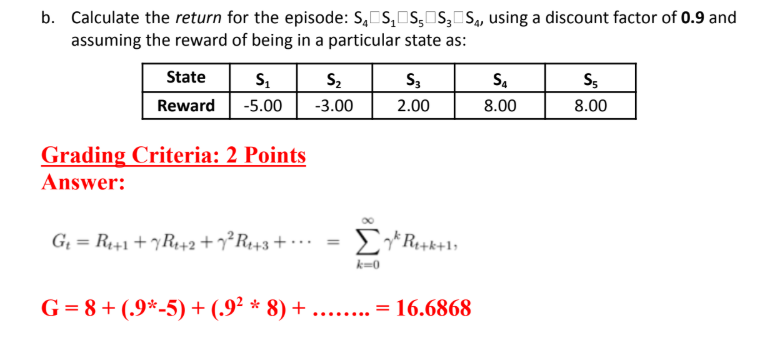
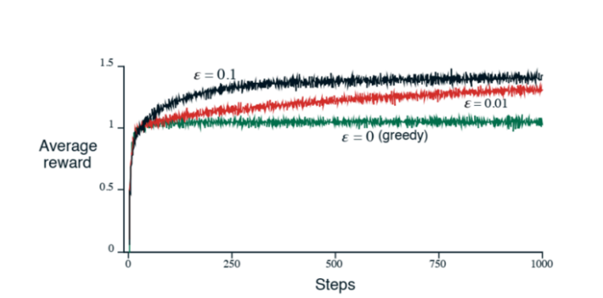
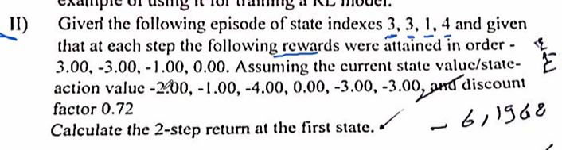
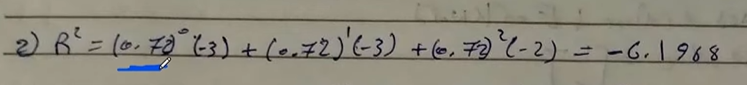
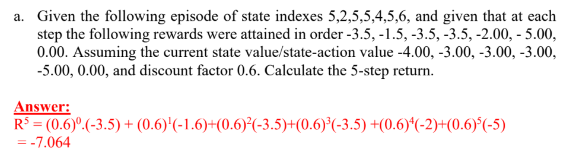

### Questions collected from these links:

**Cairo University RL Drive 1 :** https://drive.google.com/drive/folders/1dkEfcOpsroXeU-nCaPn-hlr8y6nWuiaz 

**Cairo University RL Drive 2 :**  https://drive.google.com/drive/folders/1WiGlKSzJ0wviSWu25eHqLLJoK1jqkWkh 

[sarsa,qleaning Numerical example - Google Drive](https://drive.google.com/drive/u/0/folders/1huJegZPq0f6htsYAi7DpKIunNWKuhiXE)
# Question 1 

**Solved here :** https://www.youtube.com/watch?v=2sisptKZils&list=PLxoZxAo3dSLJ_OJOA8hmuoMmHlblXLyzf&index=16&t=249s (10 min)

---
# Question 2

---
# Question 3 - Monte Carlo

---
# Question 4 : 
Briefly explain the insights observed in the below graph:

Answer [2 Points]:
The figure demonstrates the effect of exploration vs. exploitation.

==When ε = 0, t==he average reward being plateaued (i.e., almost constant)

==As ε is increased from 0 → 0.1==, the average reward starts to increase as the agent can randomly
choose actions that can offer better rewards instead of being limited to its experience.

==As ε is increased from 0.01 → 0.1==, the rate of increase is better as the agent can find better
reward in less number of steps compared to 0.01.

---
# Question 6: Theoretical
**b. In the ε-greedy action selection method, and for the case of two actions and ε = 0.25, what
is the probability that the greedy action is selected? Elaborate on your answer.
Answer [2 Points]:**

Total = 0.75+ 0.125 = 0.875
The Probability of choosing the greedy action: 1- ε = 0.75 [1 Point]
The probability of choosing the greedy action but randomly is ε * (1⁄2) = 0.25*0.5 = 0.125
[1 Point] Note (1⁄2) since we only have 2 actions

**c. What is the purpose of using the discount factor ‘γ’ when estimating returns in an MDP?
Is it necessary for all types of RL problems and why?**
Answer [2 Points]:

Problems with finite episodes can be solved without a discount factor, but problems with
infinite episodes must use a discount factor so we can have a bounded cumulative reward.
Hence, it is not mandatory in all cases but it simplifies equations by formulating solution
that can work in all cases.

**b. In ε-greedy action selection, for the case of two actions and ε = 0.5, what is the
probability that the greedy action is selected? Explain your answer.**

derivation
0.5 probability derived of choosing the greedy action, which is 1-ε
= 1-0.5 = 0.5
0.25% chance derived of being chosen as the random option with
ε= 0.5x0.5=0.25
The probability is 0.5+0.25 = 0.75

**Whats the main shortcoming of TD learning that Q-learning resolves?**
TD value learning provides a value for each state for a given policy . It is impossible to get the optimal policy directly from the learned values because the state values are learned for the given policy . And if we want to follow policy iteration to extract an improved policy from these values, we would need to use the R and T functions (which we dont have). With Q-learning, we can get values of Q-states (i.e., (state, action) pairs) of the optimal policy, from which we can extract an optimal policy simply by taking the action corresponding to the maximum Q-value from each state.

---
# Question 7 : TD n step

---
# Question 8: TD n step

# Question 9 :
